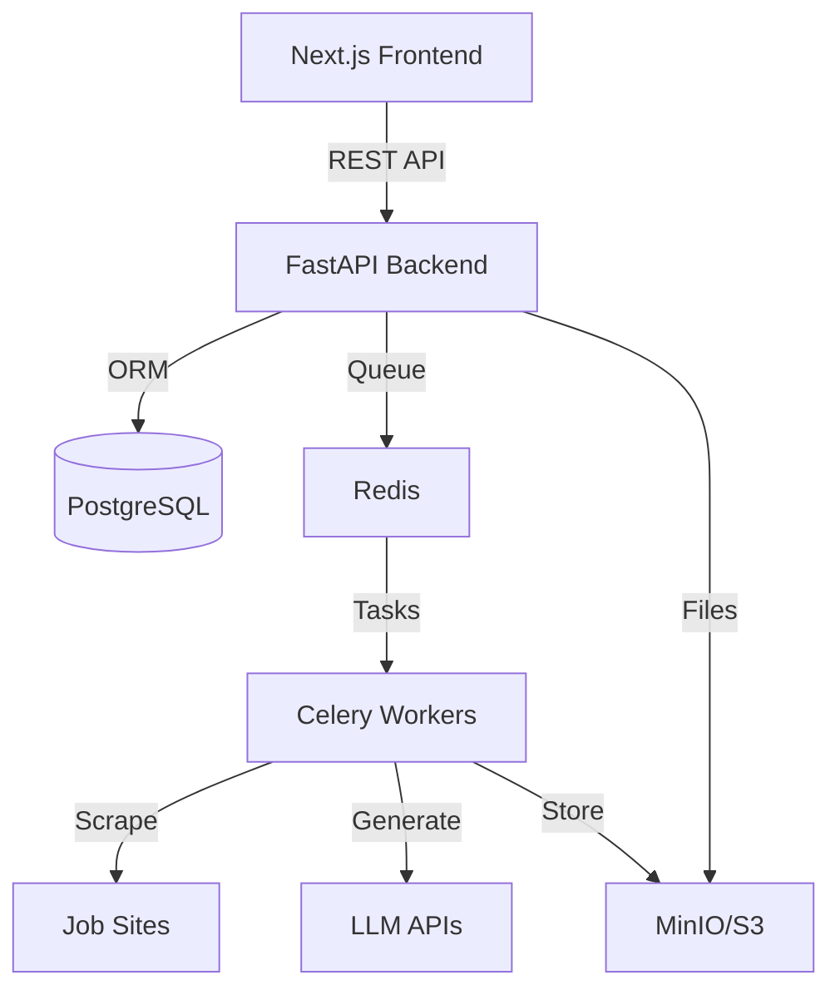

# LaudatorAI

<div align="center">


**Your AI Advocate in the Job Market**

[](https://opensource.org/licenses/MIT)
[](https://www.python.org/downloads/)
[](https://fastapi.tiangolo.com/)
[](https://nextjs.org/)
[](https://www.typescriptlang.org/)
[](https://www.postgresql.org/)
[](https://redis.io/)

[Features](#-features) •
[Demo](#-demo) •
[Quick Start](#-local-development) •
[Architecture](docs/ARCHITECTURE.md) •
[Contributing](CONTRIBUTING.md) •
[License](LICENSE)

</div>

---

**LaudatorAI** is your AI advocate in the job market, inspired by the ancient *laudator* — one who praises and elevates others' achievements. This platform automates the tailoring of resumes and the crafting of cover letters to match specific job postings, ensuring your applications stand out with precision and polish.

## ✨ Demo

> **Note**: Screenshots and demo video coming soon! See [docs/images/README.md](docs/images/README.md) for how to contribute demo materials.

<!-- Placeholder for demo GIF or video -->

## 🚀 Features

- **Smart Job Description Extraction**: Automatically extract and normalize job descriptions from any job posting URL
- **AI-Powered Resume Tailoring**: Use advanced AI to tailor your resume for specific job requirements
- **Cover Letter Generation**: Generate compelling, personalized cover letters
- **Professional Output**: Get polished DOCX and PDF files ready for your job applications
- **Modern Web Interface**: Beautiful, responsive UI built with Next.js and Tailwind CSS
- **Background Processing**: Asynchronous task handling with Celery for responsive UX
- **File Management**: Secure file storage with MinIO/S3 compatibility
- **Comprehensive Testing**: Full test coverage with pytest and integration tests

## 🏗️ Architecture

<div align="center">



</div>

### Technology Stack

| Layer | Technologies |
|-------|-------------|
| **Frontend** | Next.js 14, TypeScript, Tailwind CSS, shadcn/ui |
| **Backend** | FastAPI, Python 3.11+, SQLAlchemy, Pydantic |
| **Database** | PostgreSQL 15+ with JSONB support |
| **Cache/Queue** | Redis 7+ (Celery broker) |
| **Workers** | Celery with multiple queues |
| **File Storage** | MinIO / S3-compatible storage |
| **Web Scraping** | Playwright + Readability |
| **LLM** | Pluggable (OpenAI/Ollama/HuggingFace) |
| **Documents** | python-docx + WeasyPrint |
| **Deployment** | Docker, Railway (backend), Vercel (frontend) |

📚 **[View Detailed Architecture](docs/ARCHITECTURE.md)**

## 📋 Prerequisites

- Python 3.11+
- Node.js 18+
- Docker and Docker Compose (for local development)
- PostgreSQL
- Redis

## 🚀 Deployment

LaudatorAI is configured for deployment on modern cloud platforms:

- **Backend**: Deployed on Railway with PostgreSQL and Redis
- **Frontend**: Deployed on Vercel with automatic CI/CD

### Quick Deployment Steps

1. **Backend (Railway)**:
   - Connect your GitHub repository to Railway
   - Add PostgreSQL and Redis services
   - Configure environment variables (including `PORT=8000` and `BACKEND_CORS_ORIGINS`)
   - Deploy automatically on push to main

2. **Frontend (Vercel)**:
   - Connect your GitHub repository to Vercel
   - Configure environment variables
   - Deploy automatically on push to main

3. **Integration**:
   - Update CORS settings
   - Test API connectivity
   - Configure custom domains (optional)

**Important**: Set `PORT=8000` in Railway environment variables to resolve CORS issues. See [CORS Fix Guide](docs/CORS_FIX_GUIDE.md) for detailed instructions.

## 🛠️ Local Development

### Option 1: Docker Compose (Recommended for Local)

1. Clone the repository:
```bash
git clone https://github.com/caprolt/LaudatorAI.git
cd LaudatorAI
```

2. Start all services:
```bash
docker-compose up -d
```

3. Access the application:
- Frontend: http://localhost:3000
- Backend API: http://localhost:8000
- API Documentation: http://localhost:8000/docs
- MinIO Console: http://localhost:9001

### Option 2: Local Development Setup

#### Backend Setup

1. Navigate to the backend directory:
```bash
cd backend
```

2. Create a virtual environment:
```bash
python -m venv venv
source venv/bin/activate  # On Windows: venv\Scripts\activate
```

3. Install dependencies:
```bash
pip install -r requirements.txt
```

4. Set up environment variables:
```bash
cp .env.example .env
# Edit .env with your configuration
```

5. Start the backend:
```bash
uvicorn app.main:app --reload --host 0.0.0.0 --port 8000
```

#### Frontend Setup

1. Navigate to the frontend directory:
```bash
cd frontend
```

2. Install dependencies:
```bash
npm install
```

3. Start the development server:
```bash
npm run dev
```

4. Access the application at http://localhost:3000

## 📁 Project Structure

```
LaudatorAI/
├── backend/                 # FastAPI backend
│   ├── app/
│   │   ├── api/            # API endpoints
│   │   ├── core/           # Core configuration
│   │   ├── models/         # Database models
│   │   ├── schemas/        # Pydantic schemas
│   │   ├── services/       # Business logic
│   │   └── utils/          # Utility functions
│   ├── tests/              # Backend tests
│   ├── requirements.txt    # Python dependencies
│   └── Dockerfile          # Backend Docker image
├── frontend/               # Next.js frontend
│   ├── src/
│   │   ├── app/           # Next.js App Router pages
│   │   ├── components/    # React components
│   │   ├── lib/           # Utility functions
│   │   └── types/         # TypeScript types
│   ├── package.json       # Node.js dependencies
│   └── Dockerfile         # Frontend Docker image
├── docs/                  # Documentation
├── .github/workflows/     # CI/CD workflows
├── docker-compose.yml     # Local development setup
└── README.md             # This file
```

## 🧪 Development

### Code Quality

#### Backend
```bash
cd backend
# Format code
black app/
# Sort imports
isort app/
# Type checking
mypy app/
# Run tests
pytest tests/
```

#### Frontend
```bash
cd frontend
# Lint code
npm run lint
# Type checking
npm run type-check
# Build
npm run build
```

### Running Tests

The project includes comprehensive test suites for both backend and frontend:

- **Backend**: pytest with async support
- **Frontend**: Jest and React Testing Library
- **E2E**: Playwright (coming soon)

### CI/CD

The project uses GitHub Actions for continuous integration:

- Automated testing on push/PR
- Code quality checks (linting, type checking)
- Build verification
- Docker image building

## 📚 API Documentation

Once the backend is running, you can access:

- **Swagger UI**: http://localhost:8000/docs
- **ReDoc**: http://localhost:8000/redoc

## 🔧 Configuration

### Environment Variables

#### Backend (.env)
```bash
# API Configuration
API_V1_STR=/api/v1
PROJECT_NAME=LaudatorAI

# Database
POSTGRES_SERVER=localhost
POSTGRES_USER=postgres
POSTGRES_PASSWORD=password
POSTGRES_DB=laudatorai

# Redis
REDIS_URL=redis://localhost:6379/0

# File Storage
MINIO_ENDPOINT=localhost:9000
MINIO_ACCESS_KEY=minioadmin
MINIO_SECRET_KEY=minioadmin
MINIO_BUCKET_NAME=laudatorai

# LLM
OPENAI_API_KEY=your_openai_api_key_here
LLM_PROVIDER=openai
```

#### Frontend (.env.local)
```bash
NEXT_PUBLIC_API_URL=http://localhost:8000
```

## 🚀 Deployment

### Production Deployment

The project includes Docker configurations for easy deployment:

1. Build and push Docker images
2. Deploy using Docker Compose or Kubernetes
3. Configure environment variables for production
4. Set up monitoring and logging

### Environment-Specific Configurations

- **Development**: Local Docker Compose setup
- **Staging**: Production-like environment for testing
- **Production**: Optimized for performance and security

## 🤝 Contributing

We welcome contributions! Please see our [Contributing Guidelines](CONTRIBUTING.md) for details on:

- Code of conduct
- Development workflow
- Coding standards
- Testing requirements
- Pull request process

### Quick Start for Contributors

```bash
# Fork and clone the repository
git clone https://github.com/YOUR_USERNAME/LaudatorAI.git

# Set up backend
cd backend
python -m venv venv
source venv/bin/activate  # Windows: venv\Scripts\activate
pip install -r requirements.txt

# Set up frontend
cd ../frontend
npm install

# Start development
docker-compose up -d  # Or start services individually
```

## 📚 Documentation

- **[Architecture Overview](docs/ARCHITECTURE.md)** - System design and technical decisions
- **[API Documentation](docs/API_EXAMPLES.md)** - API endpoints and examples
- **[Deployment Guide](docs/DEPLOYMENT_GUIDE.md)** - Deployment instructions
- **[Contributing Guide](CONTRIBUTING.md)** - How to contribute
- **[Portfolio Highlights](PORTFOLIO.md)** - Project highlights for job applications

## 🧪 Testing

### Backend Tests

```bash
cd backend
pytest                    # Run all tests
pytest --cov=app tests/   # With coverage
pytest -v                 # Verbose output
```

### Frontend Tests

```bash
cd frontend
npm test                  # Run tests
npm run type-check        # TypeScript validation
npm run lint              # ESLint
```

### Code Quality

```bash
# Backend
cd backend
black app/               # Format code
isort app/               # Sort imports
mypy app/                # Type checking
flake8 app/              # Linting

# Frontend
cd frontend
npm run lint             # ESLint
npm run type-check       # TypeScript
```

## 📄 License

This project is licensed under the MIT License - see the [LICENSE](LICENSE) file for details.

## 🙏 Acknowledgments

- Inspired by the ancient Roman tradition of the *laudator*
- Built with modern open-source technologies
- Special thanks to all contributors

## 📧 Contact & Links

- **GitHub**: [caprolt/LaudatorAI](https://github.com/caprolt/LaudatorAI)
- **Issues**: [Report a bug or request a feature](https://github.com/caprolt/LaudatorAI/issues)
- **Discussions**: [Join the community](https://github.com/caprolt/LaudatorAI/discussions)

## ⭐ Show Your Support

Give a ⭐️ if this project helped you!

---

<div align="center">

**LaudatorAI** - Your AI advocate in the job market 🚀

Made with ❤️ by developers, for developers

</div>
